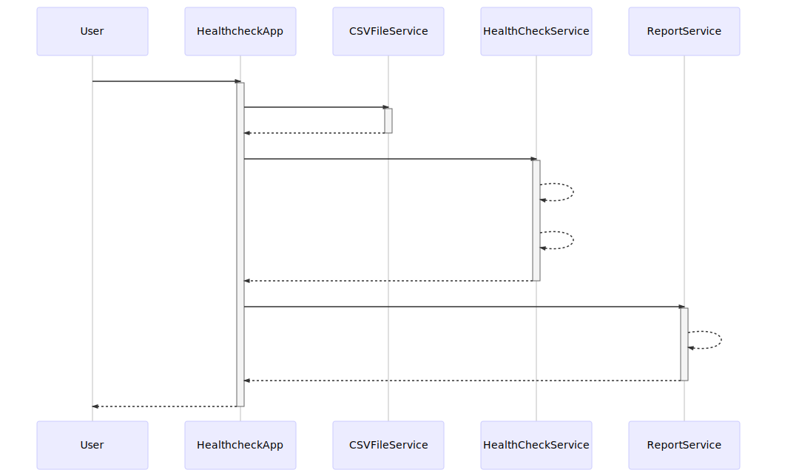

# Springboot Application - Website Healthcheck

Demonstrate website healthcheck implementation in JAVA with Springboot.

```
check website and response time when given the CSV list,
calls the Healthcheck Report API to send the statistic of each website
```

## Configuration

### Config file
Before usage, application required following configs in `config.properties`.
```
healthcheck.report.url=<Healthcheck report API>
healthcheck.report.token=<LINE OAuth2 token>
```

NOTE: for `How to generate LINE OAuth2 Token`, please see in bottom section.

### CSV file
Create simple CSV file to provided website list for testing website healthcheck.

#### Example file - test.txt
```
https://www.google.com
https://www.facebook.com
https://developers.line.biz/en/
https://should-not-found.com
https://twitter.com/
http://where-is-whis-domain.com
```


## Usages

### Run from source code
```
./mvnw spring-boot:run -Dspring-boot.run.arguments=test.txt
```

### Run from binary
```
java -jar healthcheck-0.0.1-SNAPSHOT.jar test.txt
```

## Development

### Prerequisites
- Java 8

### Build JAR package
```
./mvnw clean package
```

### Unit Testing
```
./mvnw clean verify
```

### Sequence Diagram



## How to generate LINE OAuth2 Token

1. create `Provider` from [Line Developer Console](https://developers.line.biz/console).
   For more information, please following this [Guide](https://developers.line.biz/en/docs/line-login/web/integrate-line-login/?fbclid=IwAR3GqvNrZoFjrfF_9kYApgrIiyJyB4W7a-Ua-eD9940hYa53qMPeitgknXQ)

2. start simple expressJS server to listen request
```
var express        =         require("express");
var bodyParser     =         require("body-parser");
var app            =         express();

app.use(bodyParser.urlencoded({ extended: false }));
app.use(bodyParser.json());

app.get('/',function(req,res){
  console.log(JSON.stringify(req.query));
  res.end();
});

app.listen(3210,function(){
  console.log("Started on PORT 3210");
})
```
3. using [Ngrok](https://ngrok.com/) to routing public request to local machine

```
ngrok http 3210
```

4. update `Provider` callback with `Ngrok` URL

5. open below URL in web browser and login with LINE account

```
https://access.line.me/oauth2/v2.1/authorize?response_type=code&client_id=<CHANNEL_ID>&redirect_uri=<NGROK_URL>&state=abc1234&scope=openid
```
wheres:
- `CHANNEL_ID` - provider channel ID
- `NGROK_URL` - ngrok url which matched `Provider` callback

6. copy `code` from express server and use below `curl` command
```
curl -X POST \
  https://api.line.me/oauth2/v2.1/token \
  -H 'Content-Type: application/x-www-form-urlencoded' \
  -H 'cache-control: no-cache' \
  -d 'grant_type=authorization_code&code=<CODE>&redirect_uri=<ENCODED_NGROK_URL>&client_id=<CHANNEL_ID>&client_secret=<CHANNEL_SECRET>'
```
wheres:
- `CODE` - code from `step#5`
- `CHANNEL_ID` - provider channel ID
- `CHANNEL_SECRET` - provider channel secret
- `ENCODED_NGROK_URL` - URI encoded url which matched `Provider` callback

7. OAuth code will be provided in expressJS server

